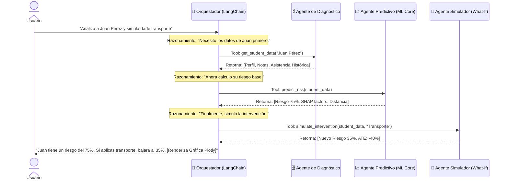


# 🤖 Arquitectura Multi-Agente (Agentic AI)

> *"Nuestra plataforma no es un chatbot estático; es un ecosistema de agentes especializados que razonan, utilizan herramientas externas y colaboran para entregar Inteligencia de Decisión."*

Para lograr una experiencia de usuario fluida donde el docente solo necesita hacer preguntas en lenguaje natural, **edUPath IM** implementa una arquitectura Multi-Agente orquestada por **LangChain**. 

Utilizamos el paradigma **ReAct (Reasoning + Acting)**, lo que permite al modelo de lenguaje (LLM) evaluar la intención del usuario y decidir qué "Agente Especializado" debe invocar.

---

## 🔄 Flujo de Orquestación (Sequence Diagram)

El siguiente diagrama ilustra cómo se procesa una consulta compleja, por ejemplo: *"Analiza a Juan Pérez y dime qué pasa si le damos la ruta escolar"*.



---

## 🧩 Los 3 Agentes Especializados

### 1. Agente de Diagnóstico (Data Agent)

* **Función:** Es el puente entre el lenguaje natural y nuestras bases de datos estructuradas (PostgreSQL/MongoDB). Traduce la intención del usuario en consultas SQL/NoSQL seguras.
* **Herramientas (Tools):** `fetch_student_profile`, `get_historical_attendance`, `get_academic_record`.
* **Output:** Un JSON normalizado con el perfil completo de riesgo del estudiante listo para ser procesado por los modelos.

### 2. Agente Predictivo (ML Core)

* **Función:** Es el encargado de ejecutar el modelo predictivo (CatBoost) y el explicador (SHAP).
* **Horizonte:** 1 año vista (dividido en trimestres Q1, Q2, Q3, Q4).
* **Herramientas (Tools):** `calculate_dropout_probability`, `explain_risk_factors`.
* **Output:** Un array de probabilidades temporales y un diccionario de factores explicativos que el Orquestador traduce a lenguaje natural empático.

### 3. Agente de Intervención (Causal Simulator)

* **Función:** El agente más avanzado del sistema. Se encarga de la inferencia causal y la generación de escenarios contrafactuales respondiendo a la pregunta: *"¿Qué intervención maximiza la probabilidad de retención con los recursos disponibles?"*
* **Herramientas (Tools):** `apply_treatment`, `estimate_counterfactual`.
* **Output:** La curva verde punteada (reducción del riesgo) que el usuario ve en la interfaz.

---

## 💻 Implementación del Orquestador (LangChain)

A nivel de código, configuramos nuestras funciones de Machine Learning como `Tools` que el LLM puede invocar de forma autónoma.

```python
from langchain.agents import initialize_agent, Tool, AgentType
from langchain.chat_models import ChatOpenAI
from edupath.ml import predict_risk, simulate_intervention

# 1. Definición de Herramientas (Tools) para el LLM
tools = [
    Tool(
        name="Predictor de Riesgo",
        func=predict_risk,
        description="Útil para calcular la probabilidad de deserción escolar de un estudiante dado su ID."
    ),
    Tool(
        name="Simulador Causal",
        func=simulate_intervention,
        description="Útil para simular cómo cambiaría el riesgo de un estudiante si se aplica una intervención (ej. transporte, beca)."
    )
]

# 2. Inicialización del LLM (Motor de Razonamiento)
llm = ChatOpenAI(temperature=0, model="gpt-4-turbo")

# 3. Creación del Agente ReAct
edupath_agent = initialize_agent(
    tools, 
    llm, 
    agent=AgentType.CHAT_ZERO_SHOT_REACT_DESCRIPTION, 
    verbose=True
)

# 4. Ejecución
response = edupath_agent.run(
    "¿Cuál es el riesgo de deserción del estudiante ID 1045 y qué pasa si le damos la ruta escolar?"
)
print(response)

```

!!! abstract "Seguridad y Privacidad"
El LLM (como GPT-4 o Llama) **nunca** es entrenado con los datos de los estudiantes. Solo actúa como un orquestador que "llama" a las herramientas de análisis de forma anónima, asegurando el cumplimiento de la normativa de protección de datos de menores.

